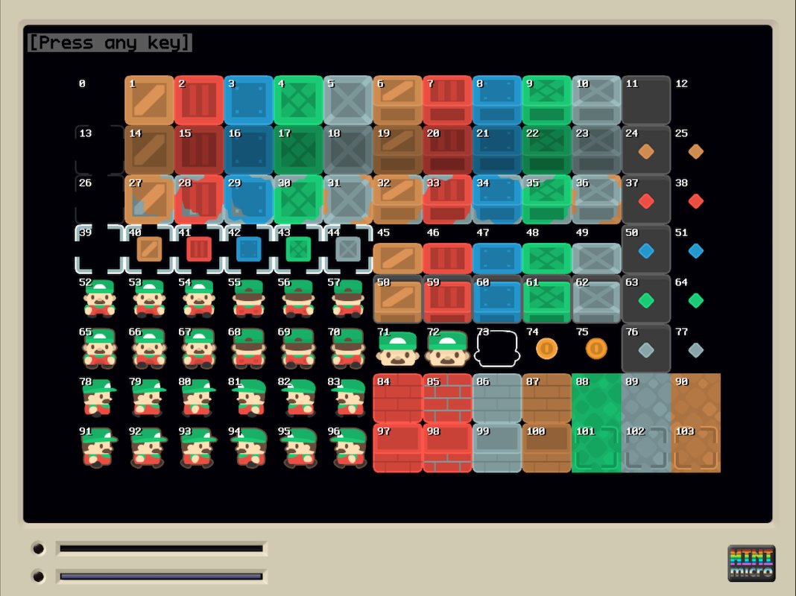

# Tileset Viewer

A little tileset viewer tool for the Mini Micro

## Usage

This tool needs an already-configured TileDisplay. In particular what needs to be configured is:

- The tileSet (image)
- The tileSetTileSize 

When invoking the main function `viewTileSet` the already-configured TileDisplay is passed as a parameter.

Then, the tileset image is displayed together with the corresponding tile-index numbers.



This makes it easy to know which index to use for which tile image.


## Installation

This tool can be used as a stand-alone program, but it really shines when imported as a module on system startup. That way it is always "present" and can be invoked  without replacing a loaded program.

In order to do so the file `tilesetViewer.ms` has to be put somewhere where it can be imported as a module. Preferably under 

```
/usr/lib
```

Then, your `startup.ms` needs to include something like:

```
import "tilesetViewer"

viewTileSet = function(tileDisp)
	tilesetViewer.viewTileSet tileDisp
end function

// Save this state to survive "reset"s
_saveGlobals
```

This would create a function `viewTileSet` which display the tiles of a tileset with their corresponding indexes.

You can of course choose another name.

The last line `_saveGlobals` is particularly important, otherwise this function would be deleted if you execute a `reset` statement.

